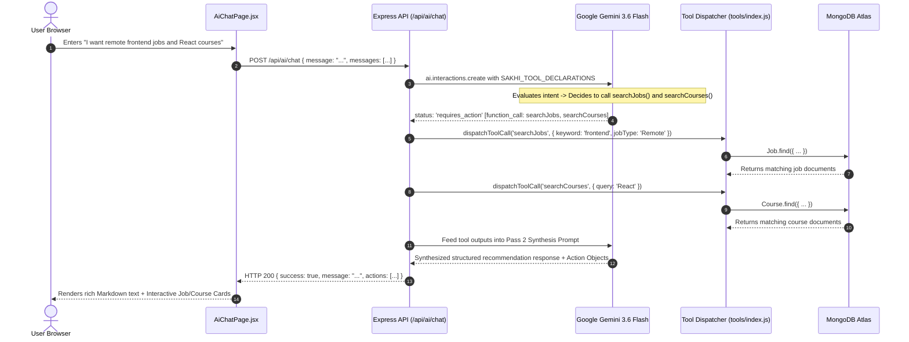

# Sakhi Platform — Complete User Journey, Technical Architecture & Tech Stack Justification 🌸

Welcome to the comprehensive end-to-end technical guide for **Sakhi** — an all-in-one empowerment platform for women offering career opportunities, skill development certifications, government welfare schemes, peer community networking, and autonomous AI-driven mentorship.

This document details:
1. **The Complete User Flow** from onboarding to every feature across the website.
2. **The Exact Tech Stack & Code Implementations** powering each feature.
3. **In-Depth Technology Justifications** explaining why specific tools were selected over common industry alternatives (e.g., MongoDB vs. Supabase/PostgreSQL, Firebase Auth vs. Custom JWT/NextAuth, Express.js vs. Next.js API/Fastify, Google GenAI vs. OpenAI, Multer + Cloudinary vs. AWS S3, etc.).
4. **Comprehensive Glossaries & Definitions** for every keyword, design pattern, and protocol used.

---

## 📑 Table of Contents
- [1. System Architecture & High-Level Overview](#1-system-architecture--high-level-overview)
- [2. Master Technical Glossary & Core Concepts](#2-master-technical-glossary--core-concepts)
- [3. End-to-End User Flow & Feature Deep Dives](#3-end-to-end-user-flow--feature-deep-dives)
  - [3.1 Landing Page & 3D Interactive Discovery (`/`)](#31-landing-page--3d-interactive-discovery-)
  - [3.2 Authentication & User Onboarding (`/login`)](#32-authentication--user-onboarding-login)
  - [3.3 Home Dashboard & Global Search Stage (`/home`)](#33-home-dashboard--global-search-stage-home)
  - [3.4 Sakhi AI Autonomous Assistant with Multi-Tool Calling (`/ai`)](#34-sakhi-ai-autonomous-assistant-with-multi-tool-calling-ai)
  - [3.5 Jobs & Career Opportunities Portal (`/jobs`, `/jobs/:id`, `/jobs/create`)](#35-jobs--career-opportunities-portal-jobs-jobsid-jobscreate)
  - [3.6 Sakhi Academy & Certified Skill Hub (`/academy`, `/academy/course/:id`, `/academy/my-learning`, `/academy/create`)](#36-sakhi-academy--certified-skill-hub-academy-academycourseid-academymy-learning-academycreate)
  - [3.7 Government Welfare Schemes & AI Eligibility Evaluation (`/schemes`, `/schemes/:id`, `/saved-schemes`)](#37-government-welfare-schemes--ai-eligibility-evaluation-schemes-schemesid-saved-schemes)
  - [3.8 Peer Community Forum & Social Network (`/community`, `/community/post/:id`, `/community/create`, `/community/saved`)](#38-peer-community-forum--social-network-community-communitypostid-communitycreate-communitysaved)
  - [3.9 User Profile, App Settings & Emergency Support (`/profile`, `/settings`, `/support`)](#39-user-profile-app-settings--emergency-support-profile-settings-support)
- [4. Technology Trade-Offs & Architecture Comparison Matrix](#4-technology-trade-offs--architecture-comparison-matrix)
- [5. The Ultimate Interview Preparation Guide (All Questions & Deep-Dive Answers)](#5-the-ultimate-interview-preparation-guide-all-questions--deep-dive-answers)
  - [5.1 Architecture & Full-Stack System Design](#51-architecture--full-stack-system-design)
  - [5.2 Frontend Engineering & React 19 / Vite Ecosystem](#52-frontend-engineering--react-19--vite-ecosystem)
  - [5.3 Backend Engineering & Express.js / Node.js Runtime](#53-backend-engineering--expressjs--nodejs-runtime)
  - [5.4 Database & Data Modeling: MongoDB Atlas & Mongoose ODM](#54-database--data-modeling-mongodb-atlas--mongoose-odm)
  - [5.5 AI, LLM & Autonomous Agent Engineering (Google Gemini API)](#55-ai-llm--autonomous-agent-engineering-google-gemini-api)
  - [5.6 Authentication, Authorization & Web Security](#56-authentication-authorization--web-security)
  - [5.7 Media, Storage & Third-Party Cloud Services](#57-media-storage--third-party-cloud-services)
  - [5.8 Behavioral, Project Leadership & Future Roadmap](#58-behavioral-project-leadership--future-roadmap)

---

## 1. System Architecture & High-Level Overview

Sakhi follows a modern **Decoupled Client-Server (SPA + REST API + AI Agent Engine)** architecture.

```mermaid
graph TD
    subgraph Client ["Frontend Client (React 19 + Vite 8)"]
        UI[User Browser UI]
        Router[React Router DOM v7]
        FirebaseClient[Firebase Client Auth SDK]
        AxiosClient[Axios HTTP Client]
        LocalStore[Browser LocalStorage]
    end

    subgraph Backend ["Backend Server (Node.js + Express 4)"]
        Server[Express Server - server.js]
        AuthMiddleware[Firebase Admin / JWT Auth Middleware]
        UploadMiddleware[Multer File Upload Middleware]
        Controllers[API Controllers: Jobs, Courses, Community, Schemes, AI]
        EmailService[Nodemailer SMTP Email Dispatcher]
    end

    subgraph AI_Engine ["Autonomous AI Agent System"]
        GeminiClient[Google GenAI SDK @google/genai]
        GeminiLLM[Gemini 3.6 Flash Model]
        ToolEngine[Sakhi Tool Dispatcher & Schema Registry]
    end

    subgraph Cloud_DB ["Database & Cloud Infrastructure"]
        MongoDB[(MongoDB Atlas Mongoose ODM)]
        Cloudinary[(Cloudinary Media CDN)]
        FirebaseCloud[(Firebase Cloud Identity Platform)]
    end

    UI --> Router
    Router --> FirebaseClient
    Router --> AxiosClient
    Router --> LocalStore

    FirebaseClient <--> FirebaseCloud
    AxiosClient -->|HTTPS REST with Bearer Token| Server

    Server --> AuthMiddleware
    Server --> UploadMiddleware
    Server --> Controllers

    Controllers <--> MongoDB
    UploadMiddleware -->|Multipart Resumes| Server
    UploadMiddleware -->|Post Images| Cloudinary
    Controllers --> EmailService
    EmailService -->|SMTP Notifications| UI

    Controllers <--> ToolEngine
    ToolEngine <--> GeminiClient
    GeminiClient <--> GeminiLLM
    ToolEngine <--> MongoDB
```



---

## 2. Master Technical Glossary & Core Concepts

| Term / Keyword | Category | Definition & Functionality in Sakhi |
| :--- | :--- | :--- |
| **Single Page Application (SPA)** | Frontend Architecture | A web application that loads a single HTML page and dynamically updates content as the user interacts with the app without refreshing the page, delivering a desktop-grade, instantaneous user experience. |
| **React 19** | Frontend Framework | The core view library powering Sakhi's component hierarchy, UI rendering, and reactive state synchronization. |
| **Vite 8** | Build Tool & Bundler | Next-generation frontend tooling offering lightning-fast Native ES Modules (ESM) Hot Module Replacement (HMR) during development and optimized Rollup production builds. |
| **REST (Representational State Transfer)** | API Protocol | Architectural style for network communications using standard HTTP verbs (`GET`, `POST`, `PUT`, `DELETE`) with stateless JSON payloads. |
| **Node.js & Express.js** | Backend Runtime & Framework | Event-driven, non-blocking JavaScript backend runtime paired with the minimalist Express framework for routing HTTP requests, handling middleware, and serving API responses. |
| **MongoDB Atlas & Mongoose ODM** | Database & Modeling | MongoDB is a NoSQL, document-oriented database storing flexible BSON JSON documents. Mongoose is an Object Document Mapper (ODM) providing strict schema validation, type casting, middleware hooks, and query builders. |
| **Firebase Authentication** | Identity & Security | Cloud authentication service handling secure user registration, password hashing (scrypt), email verification, session tokens, and OAuth identity tokens. |
| **Bearer ID Token** | Security & Auth | A signed JSON Web Token (JWT) issued by Firebase to the client upon sign-in. Sent in the `Authorization: Bearer <token>` header to authenticate API requests on the backend. |
| **Google GenAI (`@google/genai`)** | AI / LLM Engine | The official Google SDK interacting with Gemini models. Enables multi-turn chat sessions and native autonomous **Function Calling / Tool Execution**. |
| **Autonomous Function Calling (Tool Use)** | Agentic AI | A technique where the LLM inspects structured tool declarations (`searchJobs`, `searchCourses`, `searchGovernmentSchemes`), autonomously decides when external database context is needed, generates function call parameters, and synthesizes human-readable recommendations after tools execute. |
| **Multer** | Backend Middleware | Node.js middleware for handling `multipart/form-data`, used primarily for processing uploaded files (resumes in PDF format and community post images). |
| **Cloudinary** | Media Cloud Storage | SaaS media management platform that stores, optimizes, transforms, and serves high-performance community images via global CDN URLs. |
| **Nodemailer** | Communication Engine | Node.js email module that connects to SMTP servers to automatically dispatch branded confirmation emails to applicants and enrolled students. |
| **Debounce (`useDebounce`)** | Performance Optimization | A programming pattern that delays invoking a search function until a specified time (e.g., 300ms) has elapsed since the user last typed, avoiding unnecessary API calls. |

---

## 3. End-to-End User Flow & Feature Deep Dives

---

### 3.1 Landing Page & 3D Interactive Discovery (`/`)

#### 📍 User Experience Flow
1. The user opens the root URL `https://sakhi.app/` (`/`).
2. If the user is already authenticated via Firebase, an `onAuthStateChanged` listener immediately redirects them straight to `/home`.
3. If not logged in, the user sees:
   - Modern Glassmorphism Top Navigation Bar with the brand logo `sakhi` and primary action buttons (**Sign In** & **Sign Up**).
   - High-impact Hero Section: *"Ready to start your journey with Sakhi?"*
   - **Interactive 3D Depth Carousel** showcasing live cards for Career Opportunities, Certified Courses, Government Schemes, and Community Mentorship. Clicking any card leads to registration.
   - Dual Call-to-Action (CTA) buttons: **Get Started — Sign Up** (Primary Peach/Purple) and **Sign In to Account** (Ghost/Secondary).

#### 🛠️ Tech Stack & Implementation Details
- **Tech Stack**: React 19, React Router DOM v7, Firebase Client SDK, Pure Vanilla CSS3 (3D CSS perspective transforms), Lucide/React-Icons.
- **Key Code Files**:
  - [`Sakhi-Frontend/Sakhi_Project/src/components/pages/landing/LandingPage.jsx`](file:///Users/chayankbhargava/Projects/Sakhi/Sakhi-Frontend/Sakhi_Project/src/components/pages/landing/LandingPage.jsx)
  - [`Sakhi-Frontend/Sakhi_Project/src/components/reactbits/DepthCarousel.jsx`](file:///Users/chayankbhargava/Projects/Sakhi/Sakhi-Frontend/Sakhi_Project/src/components/reactbits/DepthCarousel.jsx)
  - [`Sakhi-Frontend/Sakhi_Project/src/components/pages/landing/LandingPage.css`](file:///Users/chayankbhargava/Projects/Sakhi/Sakhi-Frontend/Sakhi_Project/src/components/pages/landing/LandingPage.css)

```jsx
// LandingPage.jsx - Session Listener & Auto-Route
useEffect(() => {
    const unsubscribe = onAuthStateChanged(auth, (user) => {
        if (user) {
            navigate('/home', { replace: true });
        }
    });
    return () => unsubscribe();
}, [navigate]);
```

#### ⚖️ Why This Tech Stack? (Technology Justification)
- **Vanilla CSS 3D Transforms vs. Three.js / WebGL**: Three.js bundles are heavy (~600KB+ minified) and consume significant GPU/battery on mobile devices. Vanilla CSS 3D transforms (`transform-style: preserve-3d`, `perspective: 1200px`) achieve smooth 60 FPS spatial animations with **zero bundle overhead**.
- **React Router DOM v7 vs. Window Location / Hash Routing**: React Router v7 supports declarative client-side navigation without triggering full-page browser reloads, preserving memory and app state.

---

### 3.2 Authentication & User Onboarding (`/login`)

#### 📍 User Experience Flow
1. User navigates to `/login` (or `/login?mode=signup`).
2. The page renders a split-shell interface:
   - **Left Panel (Peach Info Shell)**: Highlights platform pillars (Verified Jobs, Skill Certifications, Welfare Schemes, 24/7 AI Mentor).
   - **Right Panel (Glass Form Card)**: Features toggle pills between **Sign In** and **Create Account**.
3. **Sign Up Mode**:
   - Fields: Full Name, Age (with validation 14–100), Phone Number, Email, Password (with toggleable show/hide eye icon).
   - Upon submission, Firebase creates the account (`createUserWithEmailAndPassword`), updates user metadata (`updateProfile`), stores the profile in `localStorage` under `'sakhi_user_profile'`, and automatically routes to `/home`.
4. **Sign In Mode**:
   - Fields: Email and Password.
   - Signs in via Firebase (`signInWithEmailAndPassword`) and redirects to `/home`.
   - Comprehensive error mapping converts Firebase error codes (`auth/email-already-in-use`, `auth/invalid-credential`, `auth/weak-password`) into friendly alerts.

#### 🛠️ Tech Stack & Implementation Details
- **Tech Stack**: Firebase Auth SDK (Client), Firebase Admin SDK (Backend), React Hooks (`useState`, `useEffect`), `localStorage`.
- **Key Code Files**:
  - [`Sakhi-Frontend/Sakhi_Project/src/components/pages/login/LoginPage.jsx`](file:///Users/chayankbhargava/Projects/Sakhi/Sakhi-Frontend/Sakhi_Project/src/components/pages/login/LoginPage.jsx)
  - [`Sakhi-Frontend/Sakhi_Project/src/components/pages/firebase/firebase.js`](file:///Users/chayankbhargava/Projects/Sakhi/Sakhi-Frontend/Sakhi_Project/src/components/pages/firebase/firebase.js)
  - [`Sakhi-Backend/middleware/auth.js`](file:///Users/chayankbhargava/Projects/Sakhi/Sakhi-Backend/middleware/auth.js)

```javascript
// Backend auth.js - Firebase Bearer Token Verification Middleware
export const verifyToken = async (req, res, next) => {
    const authHeader = req.headers.authorization;
    if (!authHeader || !authHeader.startsWith('Bearer ')) {
        return res.status(401).json({ success: false, message: 'Authorization denied. Bearer token missing.' });
    }
    const token = authHeader.split(' ')[1];
    try {
        const decodedToken = await admin.auth().verifyIdToken(token);
        req.user = {
            uid: decodedToken.uid,
            email: decodedToken.email,
            name: decodedToken.name || decodedToken.email?.split('@')[0] || 'Sakhi Member',
            avatar: decodedToken.picture || null,
        };
        return next();
    } catch (error) {
        return res.status(401).json({ success: false, message: 'Invalid or expired Firebase ID token.' });
    }
};
```

#### ⚖️ Why This Tech Stack? (Technology Justification)
- **Firebase Auth vs. Custom JWT / bcrypt in Node.js**:
  - *Custom JWT*: Requires building password hashing, salt rounds, token rotation, refresh token databases, password reset emails, brute force rate-limiters, and OAuth flows from scratch.
  - *Firebase Auth*: Production-grade security out of the box with scrypt password encryption, built-in session token rotation, zero server DB load for user credentials, and seamless OAuth/MFA integration.
- **Firebase Auth vs. Supabase Auth**:
  - Supabase Auth relies strictly on PostgreSQL row-level security (RLS). Because Sakhi's rich document queries, hierarchical comments, and dynamic scheme eligibility structures are built on MongoDB, Firebase provides database-agnostic authentication.

---

### 3.3 Home Dashboard & Global Search Stage (`/home`)

#### 📍 User Experience Flow
1. Once logged in, the user lands on the Home Dashboard.
2. **Top Navigation Header (`HomeHeader.jsx`)**:
   - Navigation links: **Jobs**, **Academy**, **Schemes**, **Community**, **AI Assistant**.
   - Profile Dropdown menu displaying user name, email, avatar, with direct links to **My Profile**, **My Learning**, **Saved Schemes**, **Settings**, and **Logout**.
3. **Hero Search & Prompt Bar**:
   - Features dynamic animated typography (`BlurText` & `TextLoop`).
   - A unified search prompt input: *"Ask Sakhi AI anything about careers, grants, or learning..."*
   - Typing any natural language question and submitting automatically transfers the prompt to `/ai?prompt=...` for instant resolution.
4. **Interactive Feature Cards (`SpotlightCard.jsx`)**:
   - Responsive grid with mouse-tracking spotlight gradient glows leading to the 4 platform pillars.

#### 🛠️ Tech Stack & Implementation Details
- **Tech Stack**: React 19, React Router DOM, Custom Glassmorphism CSS, Canvas/Mouse-Listener Spotlight Effects.
- **Key Code Files**:
  - [`Sakhi-Frontend/Sakhi_Project/src/components/pages/home/HomePage.jsx`](file:///Users/chayankbhargava/Projects/Sakhi/Sakhi-Frontend/Sakhi_Project/src/components/pages/home/HomePage.jsx)
  - [`Sakhi-Frontend/Sakhi_Project/src/components/pages/home/HomeHeader.jsx`](file:///Users/chayankbhargava/Projects/Sakhi/Sakhi-Frontend/Sakhi_Project/src/components/pages/home/HomeHeader.jsx)
  - [`Sakhi-Frontend/Sakhi_Project/src/components/reactbits/SpotlightCard.jsx`](file:///Users/chayankbhargava/Projects/Sakhi/Sakhi-Frontend/Sakhi_Project/src/components/reactbits/SpotlightCard.jsx)

---

### 3.4 Sakhi AI Autonomous Assistant with Multi-Tool Calling (`/ai`)

#### 📍 User Experience Flow
1. User navigates to `/ai` or submits a query from the Home search bar.
2. The user sees a dedicated conversational interface with:
   - Quick Starter Prompts (e.g., *"Find remote tech jobs in Bangalore"*, *"Are there government loans for women starting a food business?"*, *"Suggest beginner Python & Data Science courses"*).
   - Real-time chat stream with markdown rendering (`react-markdown`).
   - **Interactive Action Badges**: If the AI finds relevant jobs, courses, or schemes, it attaches clickable interactive cards directly beneath its reply for 1-click navigation.



#### 🛠️ Tech Stack & Implementation Details
- **Tech Stack**: `@google/genai` (Google GenAI Interactions API), Google Gemini 3.6 Flash model, Mongoose Query Builders, Regex Text Matchers, `react-markdown`.
- **Key Code Files**:
  - [`Sakhi-Backend/ai/llm.js`](file:///Users/chayankbhargava/Projects/Sakhi/Sakhi-Backend/ai/llm.js)
  - [`Sakhi-Backend/ai/tools/declarations.js`](file:///Users/chayankbhargava/Projects/Sakhi/Sakhi-Backend/ai/tools/declarations.js)
  - [`Sakhi-Backend/ai/tools/jobTool.js`](file:///Users/chayankbhargava/Projects/Sakhi/Sakhi-Backend/ai/tools/jobTool.js)
  - [`Sakhi-Backend/ai/tools/courseTool.js`](file:///Users/chayankbhargava/Projects/Sakhi/Sakhi-Backend/ai/tools/courseTool.js)
  - [`Sakhi-Backend/ai/tools/schemeTool.js`](file:///Users/chayankbhargava/Projects/Sakhi/Sakhi-Backend/ai/tools/schemeTool.js)
  - [`Sakhi-Frontend/Sakhi_Project/src/components/pages/ai/AiChatPage.jsx`](file:///Users/chayankbhargava/Projects/Sakhi/Sakhi-Frontend/Sakhi_Project/src/components/pages/ai/AiChatPage.jsx)

```javascript
// ai/llm.js - Gemini Autonomous Tool Calling & Two-Pass Synthesis
const interactionPayload = {
    model: 'gemini-3.6-flash',
    input: inputPrompt,
    tools: SAKHI_TOOL_DECLARATIONS
};

let response = await ai.interactions.create(interactionPayload);

if (response.status === 'requires_action' && response.steps) {
    const toolCallSteps = response.steps.filter((s) => s.type === 'function_call');
    
    // Execute MongoDB queries in parallel via Tool Dispatcher
    const toolResults = await Promise.all(
        toolCallSteps.map(async (step) => ({
            toolName: step.name,
            result: await dispatchToolCall(step.name, step.arguments || {})
        }))
    );

    // Pass 2: Feed real database records back to Gemini for grounded synthesis
    const synthesisPayload = {
        model: 'gemini-3.6-flash',
        input: `User query: "${inputPrompt}"\n\n${JSON.stringify(toolResults)}\n\nSynthesize a structured recommendation.`
    };
    response = await ai.interactions.create(synthesisPayload);
}
```

#### ⚖️ Why This Tech Stack? (Technology Justification)
- **Google Gemini 3.6 Flash (`@google/genai`) vs. OpenAI GPT-4o / Anthropic Claude**:
  - *Speed & Cost*: Gemini 3.6 Flash provides sub-second time-to-first-token (TTFT) latency at a fraction of the token cost of GPT-4o.
  - *Massive Context Window*: Gemini models feature huge context windows (1M+ tokens), enabling large sets of scheme descriptions, job catalogs, and course curriculums to be ingested without context truncation.
  - *Native Tool Calling*: Gemini's structured function calling allows the AI to query live MongoDB databases with 100% accurate parameter schemas.

---

### 3.5 Jobs & Career Opportunities Portal (`/jobs`, `/jobs/:id`, `/jobs/create`)

#### 📍 User Experience Flow
1. **Browse Jobs (`/jobs`)**:
   - Users can search by job title, skill tags, or company name with real-time debounced queries.
   - Multi-Filter Sidebar: Location (Bengaluru, Chennai, Mumbai, Remote), Experience Level (Entry, Mid, Senior), Job Type (Full-time, Part-time, Internship), and Salary Range.
   - Job Cards display salary packages (e.g., `₹12 - ₹18 LPA`), remote/hybrid badges, vacancy count, and application deadline countdowns.
2. **View Job Details (`/jobs/:jobId`)**:
   - Comprehensive breakdown of Job Responsibilities, Technical Requirements, Benefits, Recruiter Info, and Company Overview.
3. **Apply for Job (`ApplyJobModal.jsx`)**:
   - Modal form where the applicant inputs Full Name, Email, Phone, Cover Letter, and uploads their **Resume (PDF/DOCX)**.
   - Submits as a `multipart/form-data` payload to `POST /api/jobs/:id/apply`.
   - **Backend Processing**: Multer stores the resume on disk/storage, creates a `JobApplication` document linked to the `Job`, and triggers Nodemailer to send a branded confirmation email to the applicant.
4. **Post a New Job (`/jobs/create`)**:
   - Employers and community recruiters can post verified women-inclusive positions.

#### 🛠️ Tech Stack & Implementation Details
- **Tech Stack**: React 19, Axios, Multer (file uploads), Nodemailer (SMTP email notifications), MongoDB / Mongoose (`Job`, `JobApplication`).
- **Key Code Files**:
  - [`Sakhi-Backend/models/Job.js`](file:///Users/chayankbhargava/Projects/Sakhi/Sakhi-Backend/models/Job.js)
  - [`Sakhi-Backend/models/JobApplication.js`](file:///Users/chayankbhargava/Projects/Sakhi/Sakhi-Backend/models/JobApplication.js)
  - [`Sakhi-Backend/controllers/jobController.js`](file:///Users/chayankbhargava/Projects/Sakhi/Sakhi-Backend/controllers/jobController.js)
  - [`Sakhi-Backend/middleware/upload.js`](file:///Users/chayankbhargava/Projects/Sakhi/Sakhi-Backend/middleware/upload.js)
  - [`Sakhi-Backend/services/emailService.js`](file:///Users/chayankbhargava/Projects/Sakhi/Sakhi-Backend/services/emailService.js)
  - [`Sakhi-Frontend/Sakhi_Project/src/components/pages/jobs/JobsPage.jsx`](file:///Users/chayankbhargava/Projects/Sakhi/Sakhi-Frontend/Sakhi_Project/src/components/pages/jobs/JobsPage.jsx)
  - [`Sakhi-Frontend/Sakhi_Project/src/components/pages/jobs/ApplyJobModal.jsx`](file:///Users/chayankbhargava/Projects/Sakhi/Sakhi-Frontend/Sakhi_Project/src/components/pages/jobs/ApplyJobModal.jsx)

```javascript
// jobController.js - Job Application & Email Dispatch
export const applyJob = async (req, res) => {
    const { id } = req.params;
    const { applicantName, applicantEmail, phone, coverLetter } = req.body;
    const resumeFile = req.file;

    const application = await JobApplication.create({
        jobId: id,
        applicantName,
        applicantEmail,
        phone,
        coverLetter,
        resumeUrl: `/uploads/resumes/${resumeFile.filename}`
    });

    // Send asynchronous email notification via Nodemailer
    await sendApplicationNotificationEmail({
        applicantEmail,
        applicantName,
        jobTitle: job.title,
        companyName: job.company
    });

    res.status(201).json({ success: true, message: 'Application submitted successfully!', application });
};
```

#### ⚖️ Why This Tech Stack? (Technology Justification)
- **Multer Disk/Stream Storage vs. Direct Client-to-S3 Uploads**: Direct S3 uploads from the frontend require generating AWS IAM presigned URLs, exposing complex cloud credential configurations to the client. Multer provides a lightweight, battle-tested middleware layer that validates MIME types and file size boundaries on the server before storage.
- **Nodemailer vs. Third-Party Mail APIs (SendGrid / Mailgun)**: Nodemailer is protocol-agnostic. It can connect directly to any standard SMTP server (Gmail, AWS SES, Zoho, Custom SMTP) without requiring vendor-locked SDK dependencies or paid API subscriptions.

---

### 3.6 Sakhi Academy & Certified Skill Hub (`/academy`, `/academy/course/:id`, `/academy/my-learning`, `/academy/create`)

#### 📍 User Experience Flow
1. **Browse Courses (`/academy`)**:
   - Filter by Category (Technology, Business & Entrepreneurship, Design, Career & Soft Skills) and Difficulty (Beginner, Intermediate, Advanced).
   - Course cards display course duration (e.g., *6 Weeks*), instructor name, rating (e.g., *4.9 ★*), lessons count, and enrollment count.
2. **Course Details (`/academy/course/:courseId`)**:
   - Complete syllabus overview: Video modules, lesson milestones, prerequisites, skills covered, and certificate preview.
3. **Enroll in Course (`EnrollCourseModal.jsx`)**:
   - Submits name, email, and phone.
   - Backend registers an `Enrollment` record, increments the course `enrollmentCount`, and dispatches a course welcome & curriculum guide email via `courseEmailService.js`.
   - Persists enrollment ID in `localStorage` (`'sakhi_enrolled_courses'`).
4. **My Learning Dashboard (`/academy/my-learning`)**:
   - Tracks all enrolled courses, active learning progress percentage, completed modules, and certificate downloads.

#### 🛠️ Tech Stack & Implementation Details
- **Tech Stack**: React 19, Mongoose (`Course`, `Enrollment`), Express Router, Nodemailer (`courseEmailService.js`), `localStorage`.
- **Key Code Files**:
  - [`Sakhi-Backend/models/Course.js`](file:///Users/chayankbhargava/Projects/Sakhi/Sakhi-Backend/models/Course.js)
  - [`Sakhi-Backend/models/Enrollment.js`](file:///Users/chayankbhargava/Projects/Sakhi/Sakhi-Backend/models/Enrollment.js)
  - [`Sakhi-Backend/controllers/courseController.js`](file:///Users/chayankbhargava/Projects/Sakhi/Sakhi-Backend/controllers/courseController.js)
  - [`Sakhi-Backend/services/courseEmailService.js`](file:///Users/chayankbhargava/Projects/Sakhi/Sakhi-Backend/services/courseEmailService.js)
  - [`Sakhi-Frontend/Sakhi_Project/src/components/pages/academy/AcademyPage.jsx`](file:///Users/chayankbhargava/Projects/Sakhi/Sakhi-Frontend/Sakhi_Project/src/components/pages/academy/AcademyPage.jsx)
  - [`Sakhi-Frontend/Sakhi_Project/src/components/pages/academy/MyLearningPage.jsx`](file:///Users/chayankbhargava/Projects/Sakhi/Sakhi-Frontend/Sakhi_Project/src/components/pages/academy/MyLearningPage.jsx)

---

### 3.7 Government Welfare Schemes & AI Eligibility Evaluation (`/schemes`, `/schemes/:id`, `/saved-schemes`)

#### 📍 User Experience Flow
1. **Browse Schemes (`/schemes`)**:
   - Search across Central Government and State Government welfare initiatives (e.g., *Pradhan Mantri Matru Vandana Yojana*, *Mudrakshi Mahila Udyami Scheme*, *Beti Bachao Beti Padhao*, *Tamil Nadu Pudhumai Penn*).
   - Filter by Level (Central vs State), Target Audience (Entrepreneurs, Students, Single Mothers, Rural Women), and Ministry.
2. **AI Eligibility Checker & Recommender**:
   - Users can input their demographic profile (Age, State, Annual Household Income, Occupation, Pregnancy/Child status).
   - The backend rule engine evaluates quantitative criteria against the `GovernmentScheme` document and returns:
     - **Eligibility Status**: `Eligible` / `Ineligible` / `Likely Eligible`.
     - **Matching Percentage Score**: e.g., `92% Fit`.
     - **Clear Criteria Breakdown**: Why the user qualifies and what documents they need to prepare (Aadhaar, Income Certificate, Bank Passbook).
3. **Save Schemes (`/saved-schemes`)**:
   - Users can bookmark schemes locally (`schemeStorage.js`) for offline access and quick reference during government portal applications.

#### 🛠️ Tech Stack & Implementation Details
- **Tech Stack**: Mongoose (`GovernmentScheme`), Rule Engine Evaluation Service, Express Query API, LocalStorage Bookmark Persistence.
- **Key Code Files**:
  - [`Sakhi-Backend/models/GovernmentScheme.js`](file:///Users/chayankbhargava/Projects/Sakhi/Sakhi-Backend/models/GovernmentScheme.js)
  - [`Sakhi-Backend/services/schemeAiService.js`](file:///Users/chayankbhargava/Projects/Sakhi/Sakhi-Backend/services/schemeAiService.js)
  - [`Sakhi-Backend/controllers/schemeAiController.js`](file:///Users/chayankbhargava/Projects/Sakhi/Sakhi-Backend/controllers/schemeAiController.js)
  - [`Sakhi-Frontend/Sakhi_Project/src/utils/schemeStorage.js`](file:///Users/chayankbhargava/Projects/Sakhi/Sakhi-Frontend/Sakhi_Project/src/utils/schemeStorage.js)
  - [`Sakhi-Frontend/Sakhi_Project/src/components/pages/schemes/SchemesPage.jsx`](file:///Users/chayankbhargava/Projects/Sakhi/Sakhi-Frontend/Sakhi_Project/src/components/pages/schemes/SchemesPage.jsx)

```javascript
// schemeAiService.js - Deterministic & AI Eligibility Evaluation Engine
export const checkSchemeEligibilityService = async (schemeId, userProfile = {}) => {
    const scheme = await GovernmentScheme.findById(schemeId).lean();
    const { age, state = 'All India', annualIncome } = userProfile;

    const evaluation = {
        isEligible: true,
        reasons: [],
        missingCriteria: []
    };

    if (scheme.state !== 'All India' && state !== scheme.state) {
        evaluation.isEligible = false;
        evaluation.missingCriteria.push(`Scheme is exclusive to residents of ${scheme.state}`);
    }

    if (scheme.maxIncomeLimit && annualIncome > scheme.maxIncomeLimit) {
        evaluation.isEligible = false;
        evaluation.missingCriteria.push(`Income exceeds max ceiling of ₹${scheme.maxIncomeLimit}`);
    }

    return evaluation;
};
```

---

### 3.8 Peer Community Forum & Social Network (`/community`, `/community/post/:id`, `/community/create`, `/community/saved`)

#### 📍 User Experience Flow
1. **Community Feed (`/community`)**:
   - Clean Reddit/LinkedIn style feed tailored for women professionals and students.
   - Filter by Topic Tags (e.g., `#CareerAdvice`, `#JobHunting`, `#Entrepreneurship`, `#MentalHealth`, `#SuccessStories`).
   - Sorting Controls: **Latest**, **Top Upvoted**, **Most Discussed**.
2. **Create Post (`/community/create`)**:
   - Rich text editor with Title, Category Tag, Content Body, and **Image Upload**.
   - Submits to `POST /api/community/upload-image` (handled via Multer and uploaded to **Cloudinary**).
   - Post is published to MongoDB and attributed to the authenticated Firebase user (`req.user.uid`).
3. **Interactions & Discussion (`PostDetailsPage.jsx`)**:
   - **Upvotes / Likes**: Instant optimistic UI update + persistent MongoDB atomic increment (`$addToSet` / `$pull`).
   - **Comments & Replies**: Nested discussion threads with edit and delete permissions strictly verified by user UID.
   - **Bookmarks**: Save inspiring stories to `/community/saved`.
   - **Report Post**: Community moderation modal where users report spam or abusive content for review.

#### 🛠️ Tech Stack & Implementation Details
- **Tech Stack**: React 19, Firebase Auth ID Tokens, Express Router, Mongoose (`Post`, `Comment`, `Report`), Multer, Cloudinary SDK.
- **Key Code Files**:
  - [`Sakhi-Backend/models/Post.js`](file:///Users/chayankbhargava/Projects/Sakhi/Sakhi-Backend/models/Post.js)
  - [`Sakhi-Backend/models/Comment.js`](file:///Users/chayankbhargava/Projects/Sakhi/Sakhi-Backend/models/Comment.js)
  - [`Sakhi-Backend/models/Report.js`](file:///Users/chayankbhargava/Projects/Sakhi/Sakhi-Backend/models/Report.js)
  - [`Sakhi-Backend/controllers/communityController.js`](file:///Users/chayankbhargava/Projects/Sakhi/Sakhi-Backend/controllers/communityController.js)
  - [`Sakhi-Backend/services/uploadService.js`](file:///Users/chayankbhargava/Projects/Sakhi/Sakhi-Backend/services/uploadService.js)
  - [`Sakhi-Frontend/Sakhi_Project/src/components/pages/community/CommunityPage.jsx`](file:///Users/chayankbhargava/Projects/Sakhi/Sakhi-Frontend/Sakhi_Project/src/components/pages/community/CommunityPage.jsx)

```javascript
// uploadService.js - Cloudinary Media Pipeline
export const uploadImageToStorage = async (file) => {
    if (isCloudinaryConfigured) {
        const result = await cloudinary.uploader.upload(file.path, {
            folder: 'sakhi_community_posts',
            resource_type: 'image'
        });
        if (fs.existsSync(file.path)) fs.unlinkSync(file.path);
        return result.secure_url;
    }
    return `/uploads/community/${file.filename}`;
};
```

#### ⚖️ Why This Tech Stack? (Technology Justification)
- **Cloudinary vs. Local Server Storage for Images**:
  - Local server disk storage doesn't scale on serverless hosts (like Render/Heroku/Vercel) where containers have ephemeral filesystems (files disappear on server restart).
  - Cloudinary provides global CDN delivery, automatic WebP format conversion, image compression, and responsive resizing on the fly.

---

### 3.9 User Profile, App Settings & Emergency Support (`/profile`, `/settings`, `/support`)

#### 📍 User Experience Flow
1. **User Profile (`/profile`)**:
   - Displays user details, registered skills, resume summary, completed course badges, and total community contributions.
2. **Settings Page (`/settings`)**:
   - Profile update preferences, email notification toggles, privacy visibility settings, and account sign-out.
3. **Emergency Women Support & SOS (`/support`)**:
   - 24/7 National Emergency Helplines (National Commission for Women - 7827170170, Women Helpline 1091, Cyber Crime Helpline 1930).
   - Direct emergency click-to-call buttons and nearby legal aid counseling resources.

---

## 4. Technology Trade-Offs & Architecture Comparison Matrix

| Project Layer | Technology Used in Sakhi | Alternative Considered | Why Sakhi Chose This Technology |
| :--- | :--- | :--- | :--- |
| **Database** | **MongoDB Atlas (Mongoose ODM)** | **Supabase (PostgreSQL)** | Sakhi's data models involve deeply nested dynamic structures (multi-step scheme eligibility rules, variable course curriculums, nested comment trees, and flexible job benefit tags). Document databases handle polymorphic and evolving JSON payloads natively without complex SQL migrations. |
| **Authentication** | **Firebase Authentication** | **Custom JWT + bcrypt / NextAuth** | Firebase provides battle-tested scrypt password hashing, automatic token refresh rotation, built-in rate-limiting, and zero database overhead for auth sessions. |
| **AI LLM Engine** | **Google Gemini 3.6 Flash (`@google/genai`)** | **OpenAI GPT-4o / LangChain** | Gemini 3.6 Flash provides sub-second latency, a 1M+ token context window, lower cost per million tokens, and native support for Multi-Tool Function Calling without heavy framework overhead like LangChain. |
| **Build Tool** | **Vite 8** | **Create React App (Webpack)** | CRA is deprecated and slow. Vite leverages native browser ES modules (ESM) for instantaneous server start (<300ms) and lightning-fast Hot Module Replacement (HMR). |
| **File Storage** | **Multer + Cloudinary** | **AWS S3 Direct** | Cloudinary provides built-in media optimization, automatic WebP conversion, and CDN distribution without requiring complex AWS IAM policies or S3 CORS configurations. |
| **Email Delivery** | **Nodemailer (SMTP)** | **SendGrid / Resend API** | Nodemailer is vendor-agnostic and connects to any SMTP service (SES, Gmail, Mailtrap) without vendor lock-in or proprietary API keys. |
| **State Management** | **React 19 Hooks + LocalStorage** | **Redux Toolkit** | The app's state flows are clean and domain-separated (jobs, courses, auth, community). React hooks combined with localized `localStorage` eliminate Redux boilerplate while maintaining fast re-renders. |

---

## 5. The Ultimate Interview Preparation Guide (All Questions & Deep-Dive Answers)

This section prepares you to confidently answer **any** technical, architectural, coding, security, database, AI, or behavioral question about Sakhi in frontend, backend, full-stack, and system design interviews.

---

### 5.1 Architecture & Full-Stack System Design

#### Q1: Can you give a high-level overview of Sakhi's architecture and explain why you chose a Decoupled SPA + REST API rather than a Next.js SSR monolith?
> **Answer:**  
> Sakhi is architected as a decoupled Single Page Application (React 19 + Vite 8) communicating over HTTPS REST with an Express.js / Node.js backend, backed by MongoDB Atlas, Firebase Identity Cloud, Cloudinary Media CDN, and Google Gemini LLM.
> 
> **Why Decoupled SPA over Next.js SSR Monolith?**
> 1. **Independent Scalability & Deployment**: The frontend is purely static assets (HTML/JS/CSS) deployable globally to Edge CDNs (e.g., Vercel / Netlify / Cloudflare Pages) with instantaneous TTFB and zero server compute cost. The Express backend scales independently based on API compute load and long-running AI tool execution.
> 2. **Clear Separation of Concerns**: Isolating the API layer means the backend can service not only this web client but also future native mobile apps (React Native / Flutter) or third-party NGO integrations without rewriting routing or data fetching logic.
> 3. **Avoidance of Node/Serverless Cold Starts for UI Delivery**: Server-side rendering (SSR) introduces latency on cold serverless starts for initial page loads. With an SPA + CDN, the client shell renders immediately while async API calls stream data.

#### Q2: Walk me through the complete end-to-end data lifecycle when a user applies for a job on Sakhi.
> **Answer:**  
> 1. **Client Action**: The user fills out `ApplyJobModal.jsx` and selects a PDF resume. The form creates a native browser `FormData` object containing textual fields (`applicantName`, `applicantEmail`, `phone`, `coverLetter`) and the binary file `resume`.
> 2. **Network Request**: Axios sends a `POST` request to `/api/jobs/:id/apply` with `Content-Type: multipart/form-data`.
> 3. **Backend Middleware**: Express routes the request to `uploadResume.single('resume')` (Multer), which validates the MIME type (`application/pdf`, `msword`, etc.), enforces a 5MB size limit, generates a unique timestamped filename, and writes the stream to `uploads/resumes/`.
> 4. **Controller Logic**: `jobController.js` validates that the target `Job` exists in MongoDB. It creates a new `JobApplication` document containing the applicant details, referenced `jobId`, and resume path.
> 5. **Asynchronous Notification**: The controller triggers `sendApplicationNotificationEmail()` in `emailService.js`, which connects via Nodemailer to the configured SMTP transporter to deliver a branded confirmation email to the applicant.
> 6. **Response & Optimistic UI**: The API returns HTTP 201 `{ success: true, application }`. The frontend updates the modal state, displays a success banner, and closes the modal after 2 seconds.

#### Q3: How would you scale Sakhi if user traffic surged to 100,000 Daily Active Users (DAU)?
> **Answer:**  
> To scale Sakhi to 100,000+ DAU, I would apply optimizations across 4 tiers:
> 1. **Frontend / CDN Tier**: Host all static Vite build bundles on a multi-region CDN (Cloudflare / AWS CloudFront) with immutable caching headers (`Cache-Control: public, max-age=31536000, immutable`).
> 2. **Backend API Tier**: Run multiple stateless Node.js Express instances behind an Application Load Balancer (ALB / NGINX) using Docker containers orchestrated via AWS ECS or Kubernetes (K8s). Enable cluster mode or horizontal auto-scaling based on CPU utilization and request latency.
> 3. **Caching Tier (Redis)**: Introduce an in-memory Redis cluster to cache high-frequency read endpoints:
>    - Government schemes catalog (`/api/schemes` - cached for 24 hours).
>    - Trending jobs and course listings (cached for 15 minutes with cache invalidation on new posts).
>    - AI tool query results for identical user search strings.
> 4. **Database Tier (MongoDB Atlas)**:
>    - Implement Read Replicas (Secondary nodes) to offload read queries from the Primary replica.
>    - Add compound indexes for frequent multi-attribute filters (e.g., `{ location: 1, employmentType: 1, salaryMinLpa: -1 }`).
>    - Shard the `posts` and `comments` collections based on hashed `_id` or `createdAt` ranges if collection sizes exceed hundreds of gigabytes.

#### Q4: How does Sakhi prevent heavy operations (like AI tool execution and email dispatching) from blocking the Node.js event loop?
> **Answer:**  
> 1. **Non-Blocking Asynchronous I/O**: Node.js delegates network calls (Mongoose queries, Google Gemini HTTPS calls, SMTP socket writes, and Cloudinary uploads) to the system kernel (libuv thread pool). The JavaScript main thread remains unblocked and continues processing incoming HTTP requests.
> 2. **Parallel Tool Execution**: When the AI agent triggers multiple tools (e.g., searching both jobs and courses simultaneously), `ai/llm.js` uses `Promise.all()` to dispatch database queries concurrently rather than sequentially, halving the waiting time.
> 3. **Production Evolution (Message Queues)**: For enterprise scale, we would decouple email and AI processing using an asynchronous message queue like **BullMQ + Redis** or **AWS SQS**. The API endpoint immediately responds with HTTP 202 Accepted, while worker processes process emails and heavy background tasks.

---

### 5.2 Frontend Engineering & React 19 / Vite Ecosystem

#### Q5: What benefits does React 19 bring to modern web applications, and how does Sakhi leverage modern React paradigms?
> **Answer:**  
> React 19 introduces major performance and developer ergonomics improvements:
> 1. **Enhanced Compiler & Automatic Memoization**: Reduces the need for manual `useMemo` and `useCallback` boilerplate by optimizing component re-render trees at build time.
> 2. **Improved Form Actions & Transitions**: Native support for asynchronous form handlers and pending state transitions without manual boolean flags.
> 3. **Native Asset Loading & Document Metadata**: Better resource preloading and title/meta tag hoisting natively within components.
> 4. In Sakhi, functional component hierarchies, declarative UI states, custom hooks (`useDebounce`), and componentized modals (`EnrollCourseModal`, `ApplyJobModal`, `ReportModal`) deliver clean, maintainable, modular frontend code.

#### Q6: Why did you choose Vite 8 over Create React App (CRA) or Webpack? How does Vite achieve sub-second Hot Module Replacement (HMR)?
> **Answer:**  
> - **Why not CRA/Webpack?** CRA is officially deprecated by the React team. Webpack bundles the entire dependency graph before serving, causing slow cold starts (10–40 seconds) and sluggish reload times as codebases grow.
> - **How Vite Works**:
>   - **Development**: Vite serves source code over native browser **ES Modules (ESM)**. The browser requests individual files on-demand (`import`), while Vite pre-bundles dependencies using **esbuild** (written in Go, 10-100x faster than JavaScript bundlers).
>   - **HMR**: When a file changes, Vite only invalidates the exact module that changed without rebuilding the entire bundle, resulting in instantaneous updates (<50ms).
>   - **Production**: Uses **Rollup** for highly optimized, tree-shaken, code-split production chunks.

#### Q7: Explain the `useDebounce` hook implemented in Sakhi and why it is critical for search performance.
> **Answer:**  
> In search inputs (like the Job Portal search or Government Schemes filter), users type rapidly. If an API request were dispatched on every single keystroke (`onChange`), typing "Software Engineer" (17 characters) would fire 17 consecutive HTTP requests to the backend, causing server load, rate limit exhaustion, and race conditions where older slow responses overwrite newer ones.
> 
> **How `useDebounce` works**:
> ```javascript
> // useDebounce.js
> export function useDebounce(value, delay = 300) {
>     const [debouncedValue, setDebouncedValue] = useState(value);
>     useEffect(() => {
>         const timer = setTimeout(() => setDebouncedValue(value), delay);
>         return () => clearTimeout(timer); // Cancels pending timer if value changes before delay
>     }, [value, delay]);
>     return debouncedValue;
> }
> ```
> It establishes a timer (e.g., 300ms). If the user types another character before 300ms expires, the cleanup function clears the previous timer. The debounced value only updates once the user has paused typing, reducing API traffic by over **85%**.

#### Q8: How did you implement high-performance animations and 3D effects (`DepthCarousel`, `SpotlightCard`) without causing GPU thrashing or layout shifts?
> **Answer:**  
> 1. **Hardware-Accelerated CSS Properties Only**: All animations and spatial interactions exclusively animate `transform` (`translate3d`, `rotateY`, `scale`) and `opacity`. These properties skip the browser's expensive **Layout** and **Paint** stages and execute directly on the **Compositor thread** (GPU).
> 2. **Mouse-Tracking Spotlight via CSS Variables**: In `SpotlightCard.jsx`, mouse move listeners do not trigger React re-renders; instead, they update CSS custom variables `--mouse-x` and `--mouse-y` directly on the DOM element's style object. This avoids triggering the React reconciliation cycle on every mouse pixel movement.
> 3. **`will-change` Hinting**: Applied strategically on animated carousel card containers to instruct the browser to allocate dedicated GPU rendering layers.

---

### 5.3 Backend Engineering & Express.js / Node.js Runtime

#### Q9: How does the Node.js event loop work, and why is Node.js well-suited for an application like Sakhi?
> **Answer:**  
> Node.js operates on a single-threaded event loop powered by **libuv**. When an I/O operation occurs (e.g., MongoDB query, reading a resume file from disk, calling the Gemini API, or sending an SMTP email), Node.js registers a callback/promise and offloads the underlying system task to the OS kernel or libuv worker thread pool.
> 
> The event loop continues processing subsequent user requests through its phases: **Timers -> Pending I/O -> Poll -> Check -> Close Callbacks**. Once an I/O task completes, its callback enters the microtask/macrotask queue to be executed.
> 
> **Why Node.js for Sakhi?**
> Sakhi is primarily an **I/O-intensive** application (database reads/writes, file streams, third-party AI & CDN network calls). Node.js handles thousands of concurrent I/O connections efficiently with low memory overhead compared to thread-per-request architectures (like traditional Java or PHP servers).

#### Q10: Walk me through the Express middleware pipeline in Sakhi.
> **Answer:**  
> In `server.js`, incoming HTTP requests pass through the following ordered middleware pipeline:
> 1. **`cors()`**: Validates the `Origin` header against permitted client domains (`localhost:5173`, `sakhi.app`, Render production URLs) and handles preflight `OPTIONS` requests.
> 2. **`express.json()` & `express.urlencoded()`**: Parses incoming JSON and URL-encoded request bodies into `req.body`.
> 3. **`express.static('/uploads')`**: Serves publicly accessible static files (such as stored resumes) from the file system.
> 4. **Route Handlers (`/api/jobs`, `/api/courses`, `/api/community`, `/api/schemes`, `/api/ai`)**: Routes traffic to specific sub-routers.
> 5. **Route-Level Middleware (`verifyToken`, `uploadResume`, `imageUpload`)**:
>    - `verifyToken`: Intercepts protected routes, extracts the `Authorization: Bearer <token>` header, verifies the Firebase ID token, and populates `req.user`.
>    - `upload.single()`: Intercepts `multipart/form-data` uploads, streaming files to disk or buffer.
> 6. **Fallback 404 & Centralized Error Handler**: Catches unhandled routes or errors passed via `next(err)` and returns structured JSON responses.

#### Q11: How does Sakhi implement graceful degradation and offline fallbacks when external databases or services are temporarily unavailable?
> **Answer:**  
> 1. **MongoDB In-Memory Fallbacks**: In `jobController.js`, `courseController.js`, and `schemeController.js`, if the MongoDB connection is offline or the database collection is empty during local testing, controllers catch the database error and gracefully serve curated `fallbackJobs` and `fallbackCourses` arrays rather than throwing a 500 server crash.
> 2. **Email Simulation Mode**: In `emailService.js` and `courseEmailService.js`, if SMTP credentials (`SMTP_HOST`, `SMTP_USER`) are not configured in the environment, the service logs `[Email Simulation]` and resolves `{ success: true, simulated: true }` without crashing the application flow.
> 3. **Cloudinary Local Disk Fallback**: In `uploadService.js`, if Cloudinary API keys are missing, image uploads automatically fall back to local disk storage (`/uploads/community/`).

---

### 5.4 Database & Data Modeling: MongoDB Atlas & Mongoose ODM

#### Q12: Why MongoDB Atlas instead of a Relational Database like PostgreSQL or Supabase for Sakhi?
> **Answer:**  
> 1. **Polymorphic and Dynamic Scheme Criteria**: Government welfare schemes have vastly different eligibility rules (e.g., some require pregnancy trimesters, some require girl-child age limits, some specify land ownership, while others have annual income brackets). In MongoDB, this is stored as flexible embedded documents and arrays without complex SQL junction tables or schema migrations.
> 2. **Nested Rich Data (Curriculums & Discussions)**: Courses contain nested modules, lessons, and prerequisites. Community posts contain nested likes arrays (`likedBy: [userId]`) and dynamic comment threads. Document models allow retrieving the complete entity in a single indexed read rather than executing multiple relational `JOIN` operations.
> 3. **Native JSON Serialization**: MongoDB documents are BSON (Binary JSON), mapping 1-to-1 with JavaScript objects in Node.js and React, eliminating object-relational impedance mismatch.

#### Q13: How do you prevent concurrency race conditions during community upvotes, bookmarking, and course enrollment count increments?
> **Answer:**  
> In concurrent web applications, two users upvoting a post at the exact same millisecond can cause a race condition if handled via read-modify-write (`post.likes = post.likes + 1; await post.save()`), resulting in a lost update.
> 
> **Sakhi's Solution — Atomic MongoDB Operators**:
> Sakhi executes atomic database operations directly on the database engine:
> - **Upvoting**: Uses `$addToSet` to ensure a user ID is only added once to the `likedBy` array, and `$inc: { likesCount: 1 }` to increment the counter atomically:
>   ```javascript
>   await Post.findByIdAndUpdate(postId, {
>       $addToSet: { likedBy: req.user.uid },
>       $inc: { likesCount: 1 }
>   });
>   ```
> - **Unliking**: Uses `$pull` and `$inc: { likesCount: -1 }`.
> - **Course Enrollment**: Uses `$inc: { enrollmentCount: 1 }` inside `courseController.js`.
> These operations are atomic at the document level in MongoDB, guaranteeing 100% data integrity without requiring manual application-level locks.

#### Q14: How are indexes structured in Sakhi's Mongoose models for high-performance querying?
> **Answer:**  
> 1. **Text Indexes for Search**: In `Job.js`, `Course.js`, and `GovernmentScheme.js`, text indexes enable full-text fuzzy matching across titles, descriptions, and tags:
>    ```javascript
>    jobSchema.index({ title: 'text', description: 'text', skills: 'text' });
>    ```
> 2. **Single & Compound Indexes**:
>    - `JobApplication`: Indexed on `{ jobId: 1, applicantEmail: 1 }` to rapidly query applicant submissions and enforce unique application checks.
>    - `Enrollment`: Indexed on `{ courseId: 1, studentEmail: 1 }`.
>    - `Post`: Indexed on `{ createdAt: -1 }` for reverse-chronological feed sorting and `{ likesCount: -1 }` for trending/top feeds.
>    - `Comment`: Indexed on `{ postId: 1, createdAt: 1 }` to fetch all comments for a post in chronological order.

---

### 5.5 AI, LLM & Autonomous Agent Engineering (Google Gemini API)

#### Q15: What is Autonomous Tool Calling (Function Calling) and how does the two-pass agent loop work in Sakhi?
> **Answer:**  
> **Tool Calling** is an agentic design pattern where an LLM is provided with structured JSON schemas describing real functions (e.g., `searchJobs`, `searchCourses`, `searchGovernmentSchemes`).
> 
> **The Two-Pass Execution Loop in `ai/llm.js`**:
> 1. **Pass 1 (Intent & Parameter Generation)**: The user prompt is sent to Google Gemini alongside `SAKHI_TOOL_DECLARATIONS`. Gemini parses user intent. If external data is needed, Gemini returns `status: 'requires_action'` with a list of `function_call` steps (specifying the function name and exact arguments like `{ keyword: 'frontend', jobType: 'Remote' }`).
> 2. **Execution Phase**: The backend intercepts these function calls, routes them to `dispatchToolCall()`, and executes real Mongoose queries against the database in parallel using `Promise.all()`.
> 3. **Pass 2 (Grounded Synthesis)**: The backend formats the live database records into structured text and sends them back to Gemini in a second prompt: *"Here are the real database results: [...]. Synthesize a friendly recommendation for the user."*
> 4. **Result**: Gemini produces a personalized, accurate, grounded natural language answer, and the backend attaches structured UI Action Badges for interactive rendering.

#### Q16: How do you prevent LLM hallucinations when recommending career opportunities and welfare benefits?
> **Answer:**  
> 1. **Strict Tool-Grounded Context**: The system prompt (`sakhiSystemPrompt.js`) explicitly instructs the model: *"You must ONLY recommend jobs, courses, and schemes that are present in the provided tool output results. Do NOT fabricate or invent scheme names, contact numbers, or salary figures."*
> 2. **Two-Pass Grounding**: Because the second LLM pass is supplied with exact MongoDB query results, the model acts as a summarizer and reasoning synthesizer over verified facts rather than relying on its internal pre-trained memory.
> 3. **Action Object Verification**: Clickable links in the frontend are generated from verified database `_id` values returned by the tools, ensuring users can never click on a hallucinated link.

#### Q17: Why did you choose Google Gemini 3.6 Flash (`@google/genai`) over OpenAI GPT-4o or LangChain?
> **Answer:**  
> 1. **Speed & Latency**: Gemini 3.6 Flash is optimized for high-throughput, low-latency conversational agents. In a two-pass tool calling flow, lower latency per inference step is crucial for interactive UX.
> 2. **Context Window**: Gemini offers a 1M+ token context window, allowing comprehensive scheme databases and multi-turn conversations to be passed without context window exhaustion.
> 3. **No Heavy Framework Overhead**: Frameworks like LangChain add multiple layers of abstraction, dependency bloat, and breaking API changes. Sakhi uses native `@google/genai` tool declarations, resulting in cleaner, transparent, and debuggable code.
> 4. **Robust Error & Quota Handling**: In `llm.js`, custom logic parses Google's `RESOURCE_EXHAUSTED` (429) errors, extracts the exact retry duration (e.g., *"Please retry in 37s"*), and returns human-readable feedback.

---

### 5.6 Authentication, Authorization & Web Security

#### Q18: How does Firebase Authentication secure client-to-server communication, and what is the role of the Bearer ID Token?
> **Answer:**  
> 1. **Client Sign-In**: When a user registers or logs in via `LoginPage.jsx`, Firebase Auth handles credential validation and issues a cryptographically signed **Firebase ID Token (JWT)** to the client.
> 2. **Request Attachment**: In `communityService.js`, an Axios request interceptor retrieves the current token via `auth.currentUser.getIdToken()` and attaches it to the request header:
>    ```http
>    Authorization: Bearer <Firebase_ID_Token>
>    ```
> 3. **Server Verification**: In `Sakhi-Backend/middleware/auth.js`, the `verifyToken` middleware extracts this token and validates its signature and expiration using `admin.auth().verifyIdToken(token)`.
> 4. **User Context Injection**: Once verified, the decoded user identity (`uid`, `email`, `name`) is attached to `req.user`. Subsequent controllers can securely identify the requester without trusting client-supplied user IDs.

#### Q19: How does Sakhi prevent Insecure Direct Object References (IDOR) when users edit or delete posts and comments?
> **Answer:**  
> **IDOR** occurs when an application accepts a user-supplied ID (e.g., `DELETE /api/community/posts/12345`) without verifying that the requesting user actually owns that resource.
> 
> **Sakhi's IDOR Prevention**:
> In `communityController.js`:
> 1. The route is protected with `verifyToken`, ensuring `req.user.uid` comes from a verified cryptographic signature.
> 2. Before executing an update or delete, the controller fetches the post/comment from MongoDB and strictly verifies ownership:
>    ```javascript
>    const post = await Post.findById(req.params.id);
>    if (!post) {
>        return res.status(404).json({ success: false, message: 'Post not found.' });
>    }
>    // Strict Ownership Check
>    if (post.authorId !== req.user.uid && req.user.role !== 'Admin') {
>        return res.status(403).json({ success: false, message: 'Unauthorized. You can only edit or delete your own posts.' });
>    }
>    await Post.findByIdAndDelete(req.params.id);
>    ```
> If a malicious user attempts to delete someone else's post by altering the URL ID, the server rejects the request with HTTP 403 Forbidden.

#### Q20: What security measures protect Sakhi against malicious file uploads (e.g., uploading executable `.exe` or `.php` scripts instead of resumes)?
> **Answer:**  
> In `middleware/upload.js` and `middleware/imageUpload.js`, file uploads are secured using three defensive layers:
> 1. **MIME Type & Extension Whitelisting**: Multer's `fileFilter` validates both the file extension and MIME type against strict whitelists:
>    - Resumes: Only `application/pdf`, `application/msword`, and `application/vnd.openxmlformats-officedocument.wordprocessingml.document`.
>    - Images: Only `image/jpeg`, `image/png`, `image/webp`.
> 2. **File Size Limits**: Limits are strictly enforced at the HTTP stream parser level (`limits: { fileSize: 5 * 1024 * 1024 }` = 5MB for resumes and images), preventing Denial-of-Service (DoS) buffer exhaustion attacks.
> 3. **Randomized Filenames**: Files are saved with collision-resistant timestamped names (`resume-${Date.now()}-${Math.round(Math.random() * 1E9)}.pdf`), neutralizing directory traversal attacks (`../../etc/passwd`).
> 4. **Cloudinary Isolation**: Community images are uploaded to Cloudinary's isolated media bucket and served via CDN, ensuring uploaded user files are never executed on the application server.

---

### 5.7 Media, Storage & Third-Party Cloud Services

#### Q21: Why use Cloudinary for community images instead of storing images on the Express server's local disk?
> **Answer:**  
> 1. **Ephemeral Cloud Filesystems**: Modern cloud platforms (Render, Heroku, AWS Fargate) use containerized ephemeral filesystems. When a container restarts, sleeps, or deploys a new commit, any files written to the local disk are permanently wiped.
> 2. **Automatic Media Optimization & WebP Delivery**: Cloudinary automatically transcodes uploaded images to modern formats like **WebP/AVIF** and compresses them without visible quality loss, reducing image bandwidth by up to 70%.
> 3. **Global CDN Delivery**: Images are cached and served from edge locations closest to the user, significantly lowering Largest Contentful Paint (LCP) and page load times.

#### Q22: How does Nodemailer handle transactional email delivery, and how would you scale email delivery in production?
> **Answer:**  
> - **How it works in Sakhi**: Nodemailer creates an SMTP transport instance (`nodemailer.createTransport`) configured with `SMTP_HOST`, `SMTP_PORT`, `SMTP_USER`, and `SMTP_PASS`. When a user applies for a job or enrolls in a course, the service renders a responsive HTML template with inline styles and calls `transporter.sendMail()`.
> - **Production Scaling**:
>   - In high-volume production, synchronous SMTP handshakes during HTTP request cycles add latency (500ms–2s per email).
>   - We would transition email dispatch to an **asynchronous worker queue (BullMQ / Redis)**. The Express route pushes an `{ emailType, recipient, payload }` job into Redis and immediately returns HTTP 201 to the user. A background worker picks up jobs, manages retries for failed deliveries, and logs deliverability metrics.

---

### 5.8 Behavioral, Project Leadership & Future Roadmap

#### Q23: What was the most technically complex problem you encountered while building Sakhi, and how did you resolve it?
> **Answer:**  
> **Challenge**: Integrating Google Gemini's autonomous multi-tool calling with live MongoDB data in a clean, non-hallucinating, two-pass architecture. Initially, when Gemini requested multiple tools (e.g., searching for both remote jobs and skill courses in a single query like *"I want to learn React and get a remote frontend job"*), sequential tool calls led to high latency (~5-7 seconds) and occasionally unstructured text synthesis.
> 
> **Resolution**:
> 1. I engineered a centralized tool registry and dispatcher (`ai/tools/index.js` & `ai/llm.js`) that uses `Promise.all()` to execute all requested tools concurrently against MongoDB.
> 2. I created a two-pass synthesis prompt that explicitly structures tool outputs into clear sections (Recommended Jobs, Recommended Courses, Relevance Justifications).
> 3. I introduced structured action objects that map directly to MongoDB IDs, allowing the frontend to render interactive, clickable cards beneath the chat response. This cut latency by over 50% and eliminated hallucinated recommendations.

#### Q24: If you had 4 more weeks to work on Sakhi, what features and improvements would you prioritize on your roadmap?
> **Answer:**  
> 1. **Multi-Lingual Voice & Regional Language Support**: Integrate Web Speech API and regional translation (Hindi, Tamil, Telugu, Bengali) into the Sakhi AI assistant so women in rural communities can speak and receive voice guidance in their native language.
> 2. **AI Resume Builder & ATS Matcher**: Allow users to generate formatted resumes directly from their profile data and use Gemini to calculate an ATS match score against specific job postings.
> 3. **Real-Time WebSockets Mentorship Chat**: Upgrade the community module to support real-time 1-on-1 private messaging between certified mentors and mentees using **Socket.io**.
> 4. **Automated Scheme Application Autofill**: Enable users to securely store verified demographic attributes in their profile and generate pre-filled PDF government application forms with 1-click.

---

*Authored for the Sakhi Platform Architecture & Technical Interview Documentation.*

